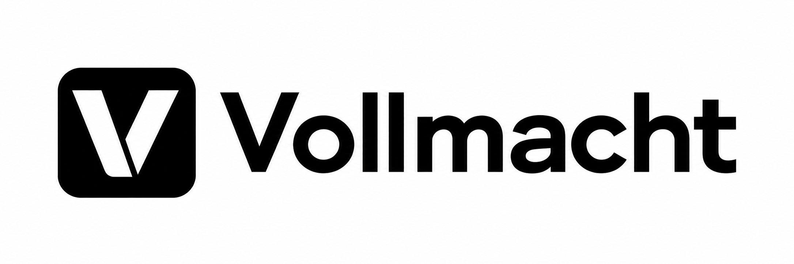

# Vollmacht Signet

The chosen identity is Signet 02: a white split V in a black rounded square. It represents an explicitly granted mandate, with a restrained, modern institutional character.

## Assets

| File | Size | Use |
| :--- | :--- | :--- |
| [vollmacht-avatar.png](vollmacht-avatar.png) | 1254 × 1254 | GitHub organization avatar and square placements |
| [vollmacht-wordmark-light.png](vollmacht-wordmark-light.png) | 2172 × 724 | Website headers, documentation, and presentations on white backgrounds |

Both files are PNG raster images with opaque white backgrounds. They are not SVG masters. Preserve their aspect ratios and existing margins. Do not stretch, recolor, add effects, or enlarge beyond their native dimensions. Keep the white V opaque. Use the square avatar where the wordmark would be too small to read.

For a website, provide `alt="Vollmacht"` when the logo identifies the site. Use empty alternative text when adjacent text already supplies the same name. A vector master and dedicated small favicon remain future refinements.

## Organization avatar

Upload `vollmacht-avatar.png` through the [organization profile settings](https://github.com/organizations/vollmachtio/settings/profile). Retain the complete square image when selecting the crop. Committing this file does not change the displayed organization avatar.

## Creation

Created with the built-in image generation tool from the user-selected Signet 02 concept. The avatar and wordmark were generated separately, so they are visual variants rather than pixel-identical derivatives of a vector master. Rejected explorations are intentionally omitted.

Avatar prompt: Extract and refine only the middle Signet symbol from the concept sheet into a standalone organization avatar. Preserve the solid black rounded square, white geometric V, softened lower-left terminal, and diagonal black separation. Center the symbol on an opaque white square canvas with safe margins for an avatar crop. No typography, labels, gradients, shadows, or mockups.

Wordmark prompt: Create a horizontal website lockup from the final Signet icon, with the icon at left and the exact word Vollmacht at right in a contemporary sans serif. Preserve the icon geometry and opaque white V. Use black lettering with balanced spacing. The final edits set the background to opaque white and repaired the wordmark spacing so every letter remains distinct.
